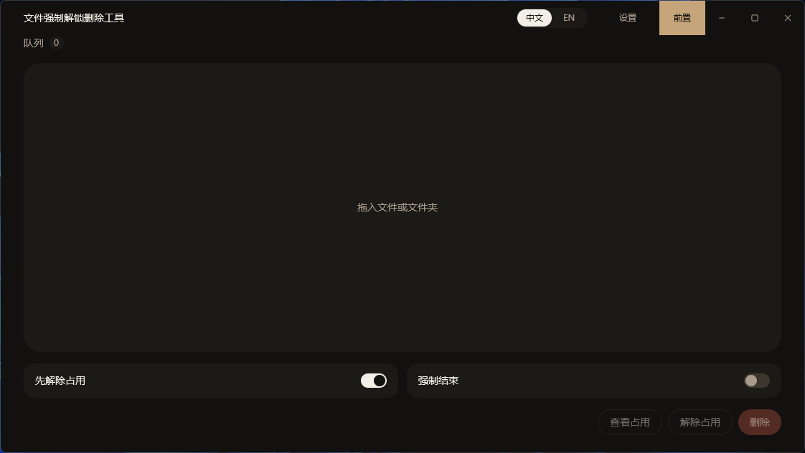
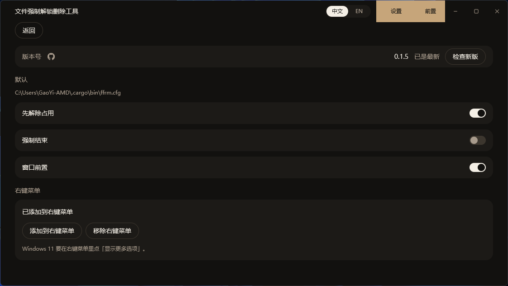

# ffrm

ffrm 是 file force rm，意思是强制删掉文件。

Windows 工具。查看谁占用了本地文件或文件夹，解除占用，然后删除。

只支持 Windows。不带参数，或直接传入路径时打开桌面窗口。`status`、`unlock`、`delete` 走命令行。`mcp` 启动给编辑器调用的服务。桌面版、命令行和 MCP 是同一个程序。





## 下载

安装包发布在 [GitHub Releases](https://github.com/gaoyia/ffrm/releases)。下载页是 [gaoyia.github.io/ffrm](https://gaoyia.github.io/ffrm/)。

已经安装 Rust 时，可以执行：

```text
cargo install ffrm
```

装好后在命令行运行 `ffrm`。

## 许可与捐赠

本仓库以 MIT 发布，全文在 `LICENSE`。

**强烈谴责A股市场环境**：作者因买入股【华铁股份】现【R通达1】不完全统计**家庭总计亏损高达200万**。目前正在起诉，进入二审阶段，执行更是不知要到什么时候了，这已经是第三、四年了，其余股票也亏损严重，现金流状况至今难以缓解。

故在此赛博要饭接受捐赠，谢谢。

| 微信赞赏码 | 支付宝领红包 | 支付宝 |
| --- | --- | --- |
|  |  |  |

## 构建

需要 Rust 1.79 或更新版本。

```text
cargo build --release
```

可执行文件在 `target\release\ffrm.exe`。构建时会把 MIT 许可复制到 `target\release\LICENSE`。

## 桌面

直接运行 `ffrm.exe`，或在命令行执行 `ffrm`。把文件或文件夹拖进窗口即可加入列表。

窗口是 16:9 横屏，标题栏由程序自己绘制，标题是「文件强制解锁删除工具」。右上角可以在中文和 English 之间切换，打开时默认中文。点「前置」后，窗口会保持在其他窗口前面。最小化、最大化、关闭和前置在悬停、按下时会改变颜色。窗口里可以查看占用、解除占用，或删除。拖入文件夹再删除，会删掉这个文件夹和里面的内容。勾选「解除占用」后，删除时会先请占用程序退出；程序没有退出时会结束该进程。「强制结束」会跳过等待。

标题栏的「设置」里可以看到版本号，旁边的图标会打开 GitHub 仓库。第一次打开时会检查 GitHub 上有没有新版本。点「检查新版」可以再查一次。有新版本时，点旁边的更新按钮会下载并替换当前程序，然后重新打开。下载时按钮背景会跟着进度铺满，这时不能再点。默认的语言、先解除占用、强制结束和窗口前置会记在程序旁边的 `ffrm.cfg`，第一次运行会写出这份文件。设置里也可以把程序加进文件和文件夹的右键菜单，或从右键菜单移除。右键后打开窗口并把选中的路径放进队列，不会直接删除。菜单图标用的是这个程序自己的图标。这项写在当前用户的注册表里。Windows 11 要在右键菜单中点「显示更多选项」才能看到。

## 命令行

```text
ffrm <路径>...
ffrm status <路径>...
ffrm unlock <路径>... [--force] [--yes]
ffrm delete <路径>... [--unlock] [--force] [--yes] [--recursive]
ffrm mcp
```

直接传入路径会打开窗口并把路径放进队列，不会删除。

`status` 列出占用该路径的进程。目录仍被占用、但没有列出进程时，会再查找当前目录正好是该文件夹的进程。

`unlock` 让这些进程退出并释放文件。进程没有退出时，会结束该进程。`--force` 会在请求退出后直接强制结束。

`delete` 删除文件或目录。路径被占用时，需要加上 `--unlock`，否则只报告占用者并停止。

没有 `--yes` 时，`unlock` 和 `delete` 会先要求输入 `y` 确认。标准输入不是终端时必须加上 `--yes`。

## 删除目录

空目录可以直接删除。目录里还有内容时，加上 `--recursive` 或 `-r`。

```text
ffrm delete D:\temp\empty-dir --yes
ffrm delete D:\temp\project --yes --recursive
```

符号链接和目录联接只删除链接本身，不会跟着删到目标里面。

删除文件时会先去掉只读属性。

## 不会删除的路径

下面这些路径本身会被拒绝。它们里面的单个文件或子目录可以删除。

- 磁盘根目录，例如 `C:\`
- Windows 目录、`System32`、`SysWOW64`
- 用户主目录，以及系统盘下的 `Users`
- `Program Files`、`Program Files (x86)`、`ProgramData`

占用者如果是关键系统进程，解除占用会被拒绝。这些进程包括 System、`smss.exe`、`csrss.exe`、`wininit.exe`、`winlogon.exe`、`services.exe`、`lsass.exe`、`dwm.exe`、`fontdrvhost.exe`。

## 示例

查看是谁占着文件：

```text
ffrm status D:\notes\a.docx
```

关掉占用程序并删除：

```text
ffrm delete D:\notes\a.docx --unlock --yes
```

## MCP

`ffrm mcp` 启动服务，从标准输入读消息，把结果写回标准输出。已经安装 Rust 时执行 `cargo install ffrm`，或从 [GitHub Releases](https://github.com/gaoyia/ffrm/releases) 下载 `ffrm.exe`。`command` 写 `ffrm`，或者写这个 exe 的完整路径。示例文件是 `mcp.example.json`。

```json
{
  "mcpServers": {
    "ffrm": {
      "command": "ffrm",
      "args": ["mcp"]
    }
  }
}
```

工具有三个，规则和命令行一样。`status` 查看占用。`unlock` 解除占用。`delete` 删除。`unlock` 和 `delete` 要把 `confirm` 设为 `true` 才会执行。文件被占用时，`delete` 还要把 `unlock` 设为 `true`。目录里还有内容时，把 `recursive` 设为 `true`。`force` 要和 `unlock` 一起用。

编辑器连上后会先发 `initialize`，再发 `tools/list`。删除一个被占用的文件时，调用类似：

```json
{
  "jsonrpc": "2.0",
  "id": 1,
  "method": "tools/call",
  "params": {
    "name": "delete",
    "arguments": {
      "path": "D:\\notes\\a.docx",
      "confirm": true,
      "unlock": true
    }
  }
}
```

## 许可

本项目使用 MIT 许可，文本在 `LICENSE`。Release 构建会把同一份文件复制到 `target\release\LICENSE`。
